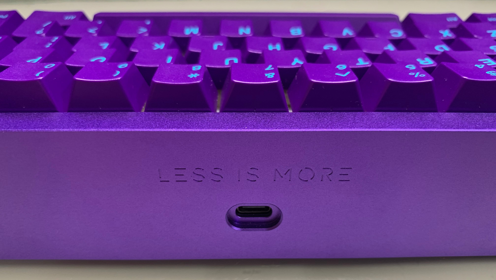
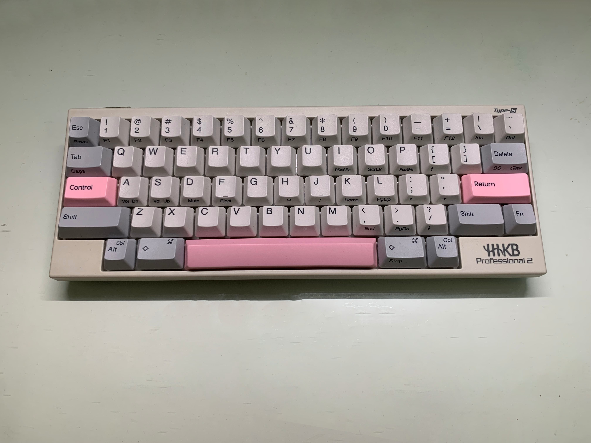
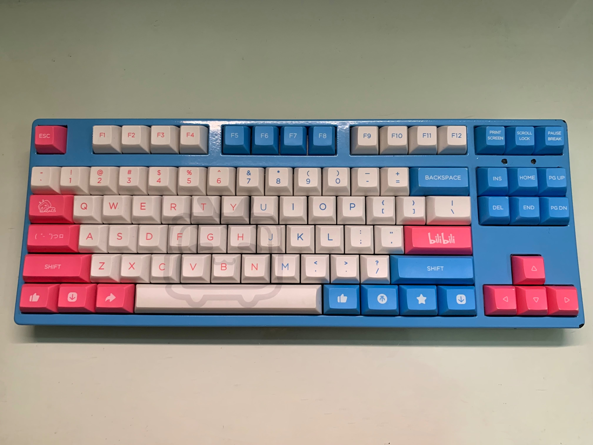
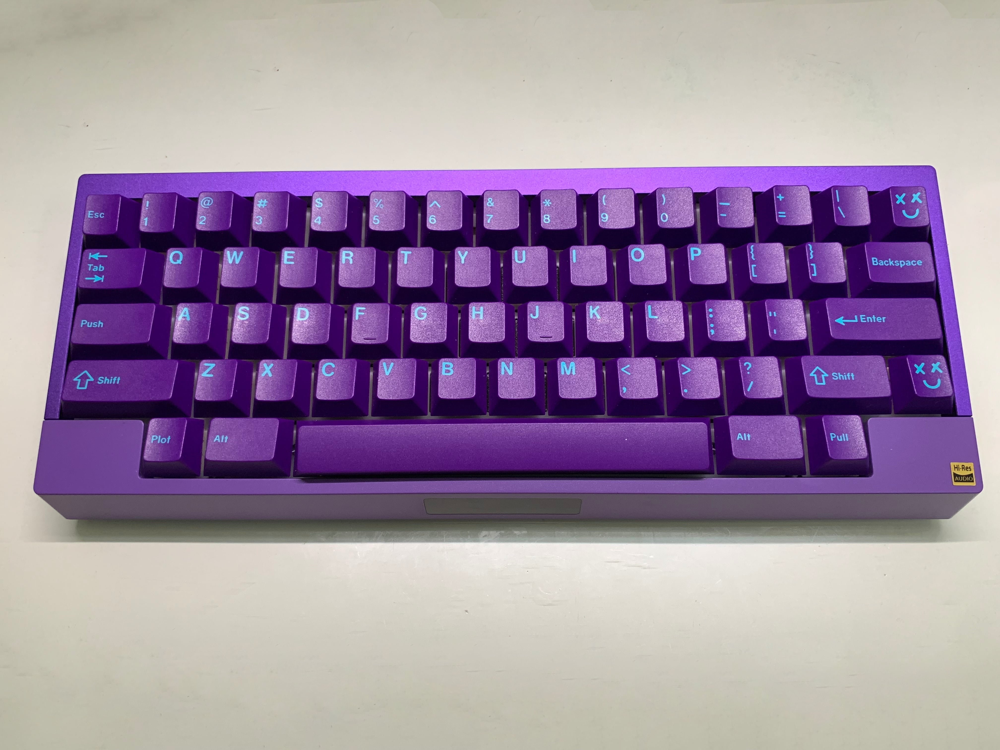
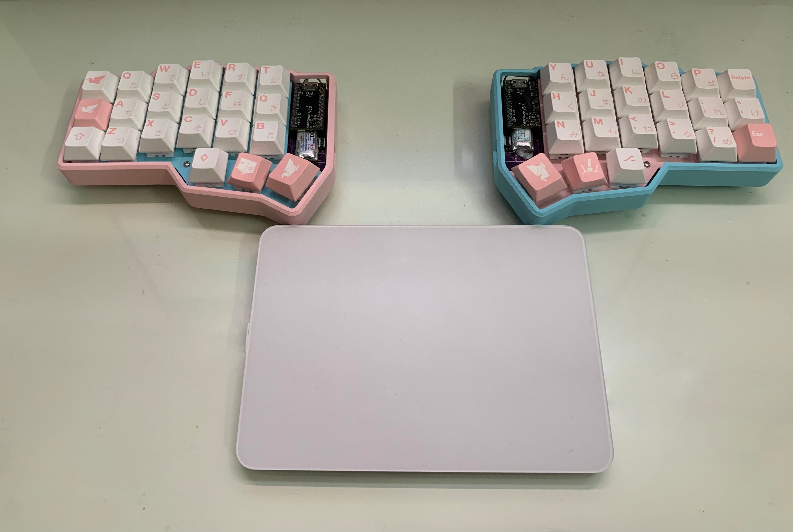
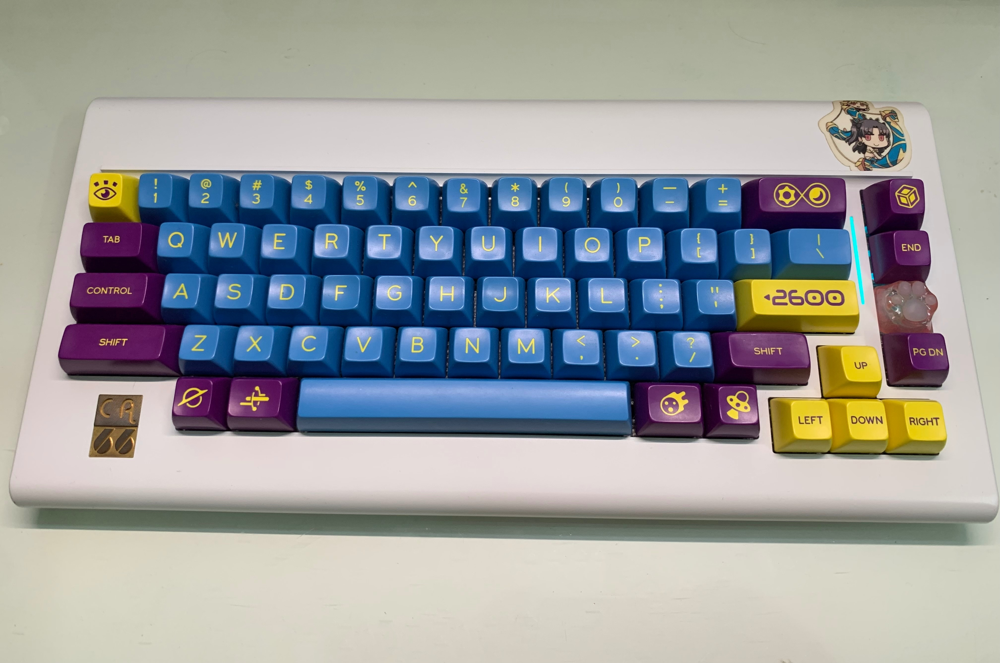
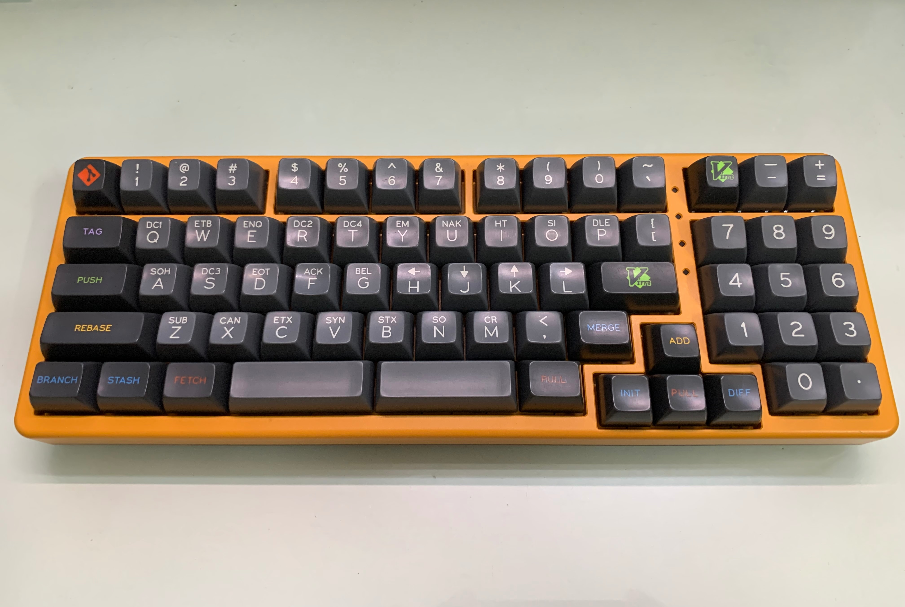
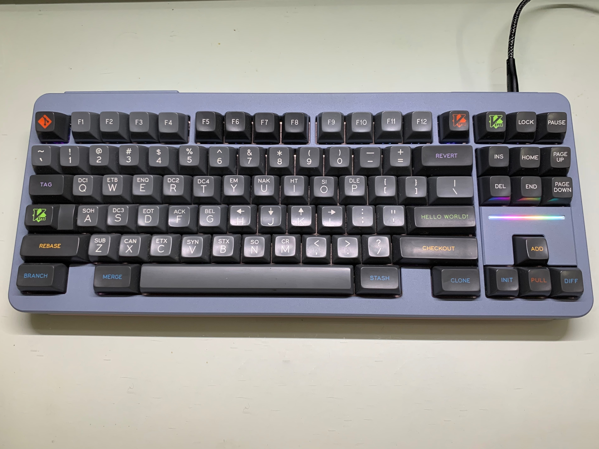
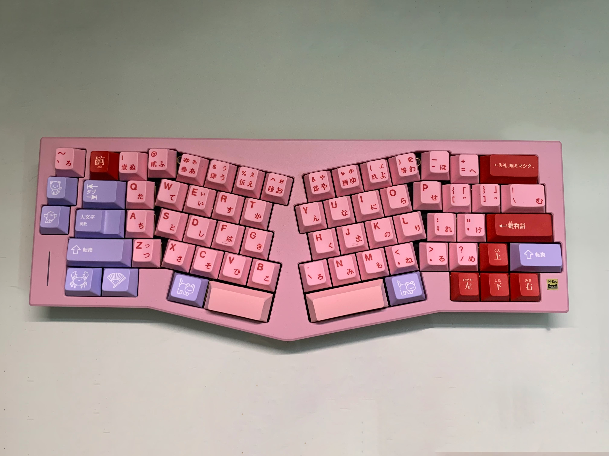

<!-- ### Hi there 👋 -->
## Monet here! 
## Hi 这里是和歌忘忧 
----

## I love Keyboard! ⌨️
### **Less is more ! 🪄**
 

 

 

 
<b>More Keyboards :-)</b> 

  <!-- height=332px -->

 

---

<!-- repo:https://github.com/journey-ad/Moe-counter -->
---

<!--  -->
<!-- &hide=javascript,html,css, -->

<!-- repo:https://github.com/anuraghazra/github-readme-stats -->

<!--
**Mo3et/Mo3et** is a ✨ _special_ ✨ repository because its `README.md` (this file) appears on your GitHub profile.

Here are some ideas to get you started:

- 🔭 I’m currently working on ...
- 🌱 I’m currently learning ...
- 👯 I’m looking to collaborate on ...
- 🤔 I’m looking for help with ...
- 💬 Ask me about ...
- 📫 How to reach me: ...
- 😄 Pronouns: ...
- ⚡ Fun fact: ...
-->

<!--  -->
